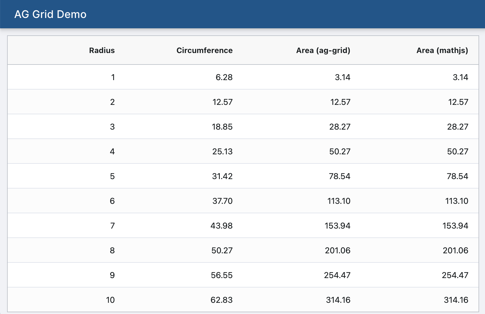

# AG Grid Demo



This example demonstrates how AG Grid column definitions can be serialized and
persisted into a JSON file. Specifically, we want to do this for 4 use cases:

1. Computed columns
2. Cell styles based on cell values
3. Custom sort
4. Custom group summary

> Note: The fourth use case was implemented using AG Grid's `getGroupRowAgg`
> function which is difficult to serialize. Hence it was left as is.

## Implementation Details

Please refer to [this JSON file](src/pages/HomePage/column-config.json) which
persists the column definitions.

### Computed columns

In this example, the following columns are computed:

1. buyAmount = quantity * buyPrice
2. sellAmount = quantity * sellPrice
3. gain = sellAmount - buyAmount

These computations are done using valueGetters with cell expressions, e.g.

```json
{
  "colId": "buyAmount",
  "headerName": "Amount",
  "valueGetter": "getValue('quantity') * getValue('buyPrice')",
  "valueFormatter": "formatNumber",
  "type": "rightAligned"
}
```

### Cell styles based on cell values

The Gain column is colored green for gain and red for loss. This is done using
cellClassRules with expressions:

```json
{
  "field": "gain",
  "headerName": "Gain",
  "valueGetter": "getValue('sellAmount') - getValue('buyAmount')",
  "valueFormatter": "formatNumber",
  "type": "rightAligned",
  "cellClassRules": {
    "loss": "x < 0",
    "profit": "x > 0"
  }
}
```

### Custom sort

The priority column implements a custom sort (L, M, H) using a comparator:

```json
{
  "field": "priority",
  "headerName": "Priority",
  "comparator": "const PriorityEnum = {L: 0, M: 1, H: 2}; return PriorityEnum[valueA] - PriorityEnum[valueB];"
}
```

### Custom group summary

The group summary has the following requirements:

1. `quanity` is sum of all quantities in the group
2. `buyAmount` and `sellAmount` are sums of all amounts in the group
3. `buyPrice` and `sellPrice` are average prices in the group weighted by the
   quantity of shares purchased or sold

This is implemented using the `getGroupRowAgg` prop of ag-grid. Note the TODO
below:

```typescript
const getGroupRowAgg = React.useCallback((params: GetGroupRowAggParams) => {
  const result = {
    quantity: 0,
    buyAmount: 0,
    sellAmount: 0,
    buyPrice: 0,
    sellPrice: 0,
  };
  params.nodes.forEach((node) => {
    if (node.group === false) {
      const data = node.data;
      result.quantity += data.quantity;
      // TODO: how to get buy amount from calculated field instead of calculating again?
      result.buyAmount += data.quantity * data.buy.price;
      result.sellAmount += data.quantity * data.sell.price;
    }
  });
  result.buyPrice = result.buyAmount / result.quantity;
  result.sellPrice = result.sellAmount / result.quantity;
  return result;
}, []);

<AgGridReact gridOptions={gridOptions} getGroupRowAgg={getGroupRowAgg} />;
```

## Development Build

```sh
npm ci
npm start
```

Now point your browser to http://localhost:3000

## Production Build

```sh
npm run build
```
