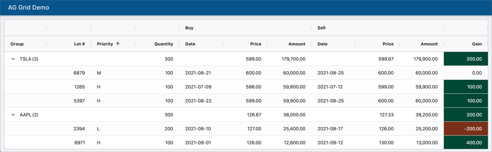

# AG Grid Demo



1. Circumference is computed using a `valueGetter` function.
2. Area (ag-grid) is computed using a `valueGetter` expression.
3. Area (mathjs) is computed using a mathjs expression.

## Development Build

```sh
npm ci
npm start
```

Now point your browser to http://localhost:3000

## Production Build

```sh
npm run build
```
